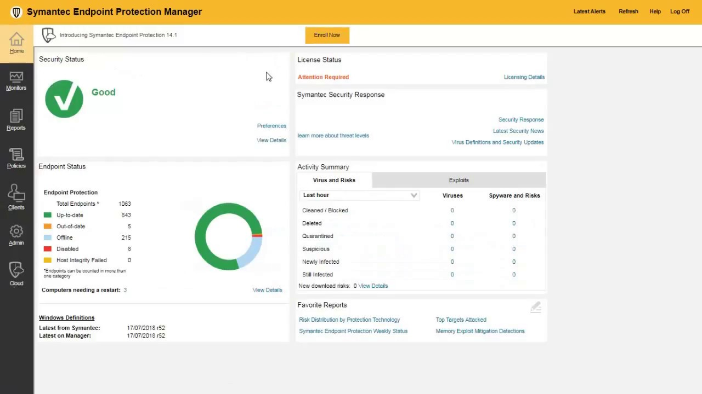

<!-- Improved compatibility of back to top link: See: https://github.com/othneildrew/Best-README-Template/pull/73 -->
<a id="readme-top"></a>

<!-- PROJECT LOGO -->
<br />
<div align="center">
  <a href="https://github.com/CamilleGayat/README-assignment">
    
  </a>

  <h3 align="center">🔐 Symantec Component Integration</h3>

  <p align="center">
    A project integrating Symantec components with third-party libraries
    <br />
  </p>
</div>

<!-- TABLE OF CONTENTS -->
<details>
  <summary>📋 Table of Contents</summary>
  <ol>
    <li>
      <a href="#about-the-project">🎯 About The Project</a>
      <ul>
        <li><a href="#built-with">🛠️ Built With</a></li>
      </ul>
    </li>
    <li>
      <a href="#getting-started">🚀 Getting Started</a>
      <ul>
        <li><a href="#prerequisites">📋 Prerequisites</a></li>
        <li><a href="#installation">⚙️ Installation</a></li>
      </ul>
    </li>
    <li><a href="#usage">💡 Usage</a></li>
    <li><a href="#roadmap">🗺️ Roadmap</a></li>
    <li><a href="#contributing">👥 Contributing</a></li>
    <li><a href="#license">📝 License</a></li>
    <li><a href="#contact">📧 Contact</a></li>
    <li><a href="#acknowledgments">🙏 Acknowledgments</a></li>
  </ol>
</details>

<!-- ABOUT THE PROJECT -->
## 🎯 About The Project

<div align="center">

</div>

This project integrates components from Symantec with third-party libraries to create a robust security solution. The integration leverages Boost v1.33.1 and TinyXML v2.4.0 to enhance functionality and performance.

Key features:
* 🔒 Secure implementation of Symantec security protocols
* ⚡ Integration with Boost libraries for improved performance
* 📄 XML parsing capabilities through TinyXML
* 💻 Cross-platform compatibility

This project adheres to all licensing requirements for both Symantec components and third-party libraries.

<p align="right">(<a href="#readme-top">back to top</a>)</p>

### 🛠️ Built With

This project is built with the following major components:

* 🔐 Symantec Security Components
* [![Boost][Boost.org]][Boost-url]
* [![TinyXML][TinyXML.org]][TinyXML-url]
* [![C++][Cpp.org]][Cpp-url]

<p align="right">(<a href="#readme-top">back to top</a>)</p>

<!-- GETTING STARTED -->
## 🚀 Getting Started

To get a local copy up and running, follow these steps.

### 📋 Prerequisites

* C++ compiler
* Boost libraries
```sh
sudo apt-get install libboost-all-dev  # For Ubuntu/Debian
```

### ⚙️ Installation

1. Clone the repo
   ```sh
   git clone https://github.com/your_username/repo_name.git
   ```
2. Navigate to the project directory
   ```sh
   cd repo_name
   ```
3. Build the project
   ```sh
   make
   ```
4. Change git remote URL to avoid accidental pushes to base project
   ```sh
   git remote set-url origin github_username/repo_name
   git remote -v # confirm the changes
   ```

<p align="right">(<a href="#readme-top">back to top</a>)</p>

<!-- USAGE EXAMPLES -->
## 💡 Usage

This project can be used to integrate Symantec security components with your application. The integration supports various security features and XML processing capabilities.

Example usage:
```cpp
#include "symantec_component.h"
#include "tinyxml.h"

int main() {
    // Initialize Symantec component
    SymantecComponent security;
    security.initialize();
    
    // Use TinyXML for configuration
    TiXmlDocument doc;
    doc.LoadFile("config.xml");
    
    // Apply security settings
    security.applyConfig(doc);
    
    return 0;
}
```

<p align="right">(<a href="#readme-top">back to top</a>)</p>

<!-- ROADMAP -->
## 🗺️ Roadmap

- [x] Integrate Boost v1.33.1
- [x] Integrate TinyXML v2.4.0
- [x] Add Symantec component support
- [ ] Add additional security features
- [ ] Improve cross-platform compatibility
- [ ] Add comprehensive documentation

See the [open issues](https://github.com/CamilleGayat/README-assignment/issues/new) for a full list of proposed features (and known issues).

<p align="right">(<a href="#readme-top">back to top</a>)</p>

<!-- CONTRIBUTING -->
## 👥 Contributing

Contributions are what make the open source community such an amazing place to learn, inspire, and create. Any contributions you make are **greatly appreciated**.

If you have a suggestion that would make this better, please fork the repo and create a pull request. You can also simply open an issue with the tag "enhancement".
Don't forget to give the project a star! Thanks again!

1. Fork the Project
2. Create your Feature Branch (`git checkout -b feature/AmazingFeature`)
3. Commit your Changes (`git commit -m 'Add some AmazingFeature'`)
4. Push to the Branch (`git push origin feature/AmazingFeature`)
5. Open a Pull Request

<p align="right">(<a href="#readme-top">back to top</a>)</p>

<!-- LICENSE -->
## 📝 License

This project contains components with different licenses:

### Symantec Components
Copyright © 2006 Symantec Corporation. All rights reserved. Symantec and the Symantec Logo are trademarks or registered trademarks of Symantec Corporation or its affiliates in the U.S. and other countries.

### Boost v1.33.1
Licensed under the Boost Software License - Version 1.0 - August 17th, 2003.
Copyright © Beman Dawes, David Abrahams, 1998-2003. All rights reserved.
Copyright Rene Rivera 2004-2005. All rights reserved.

### TinyXML v.2.4.0
Released under the zlib license.

See `LICENSE` for more information.

<p align="right">(<a href="#readme-top">back to top</a>)</p>

<!-- CONTACT -->
## 📧 Contact

Camille GAYAT - qps@gmail.com

Project Link: [https://github.com/CamilleGayat/README-assignment](https://github.com/CamilleGayat/README-assignment)

<p align="right">(<a href="#readme-top">back to top</a>)</p>

<!-- ACKNOWLEDGMENTS -->
## 🙏 Acknowledgments

* [Symantec Corporation](https://www.symantec.com)
* [Boost.org](https://www.boost.org)
* [TinyXML](http://www.grinninglizard.com/tinyxml/)
* [Choose an Open Source License](https://choosealicense.com)
* [GitHub Pages](https://pages.github.com)

<p align="right">(<a href="#readme-top">back to top</a>)</p>

<!-- MARKDOWN LINKS & IMAGES -->
<!-- https://www.markdownguide.org/basic-syntax/#reference-style-links -->
[contributors-shield]: https://img.shields.io/github/contributors/your_username/repo_name.svg?style=for-the-badge
[contributors-url]: https://github.com/your_username/repo_name/graphs/contributors
[forks-shield]: https://img.shields.io/github/forks/your_username/repo_name.svg?style=for-the-badge
[forks-url]: https://github.com/your_username/repo_name/network/members
[stars-shield]: https://img.shields.io/github/stars/your_username/repo_name.svg?style=for-the-badge
[stars-url]: https://github.com/your_username/repo_name/stargazers
[issues-shield]: https://img.shields.io/github/issues/your_username/repo_name.svg?style=for-the-badge
[issues-url]: https://github.com/your_username/repo_name/issues
[license-shield]: https://img.shields.io/badge/License-Boost%201.0-lightblue.svg?style=for-the-badge
[license-url]: https://www.boost.org/LICENSE_1_0.txt
[linkedin-shield]: https://img.shields.io/badge/-LinkedIn-black.svg?style=for-the-badge&logo=linkedin&colorB=555
[linkedin-url]: https://linkedin.com/in/your_username
[product-screenshot]: images/screenshot.png
[Boost.org]: https://img.shields.io/badge/Boost-1.33.1-blue?style=for-the-badge
[Boost-url]: https://www.boost.org/
[TinyXML.org]: https://img.shields.io/badge/TinyXML-2.4.0-orange?style=for-the-badge
[TinyXML-url]: http://www.grinninglizard.com/tinyxml/
[Cpp.org]: https://img.shields.io/badge/C++-00599C?style=for-the-badge&logo=cplusplus&logoColor=white
[Cpp-url]: https://isocpp.org/